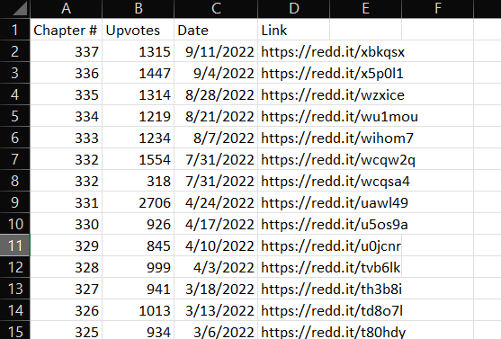

## /r/manga Chapter Collector
Simple script to organize discussion threads for a given series.



## How to Use
Have Python installed and run the following commands in cmd:

```
$ pip install praw
$ pip install pandas
```

Then just run the script and type the title exactly as it's written in the threads.
